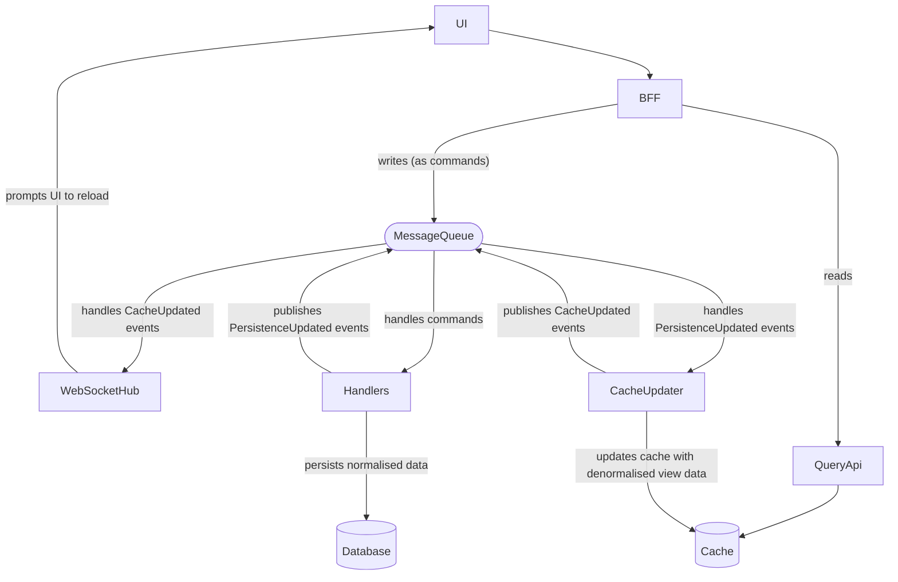

# CQRS Proof of Concept

A simple todo application using CQRS concepts:

```mermaid
flowchart TD;
    UI-->BFF;
    BFF-- writes (as commands) --->MessageQueue([MessageQueue]);
    BFF-- reads --->QueryApi;
    QueryApi-->Cache[(Cache)]
    MessageQueue-- handles CacheUpdated events --->WebSocketHub
    MessageQueue-- handles commands --->Handlers
    Handlers-- publishes PersistenceUpdated events --->MessageQueue
    MessageQueue-- handles PersistenceUpdated events --->CacheUpdater
    CacheUpdater-- updates cache with denormalised view data --->Cache
    CacheUpdater-- publishes CacheUpdated events --->MessageQueue
    Handlers-- persists normalised data --->Database[(Database)]
    WebSocketHub-- prompts UI to reload --->UI
```
