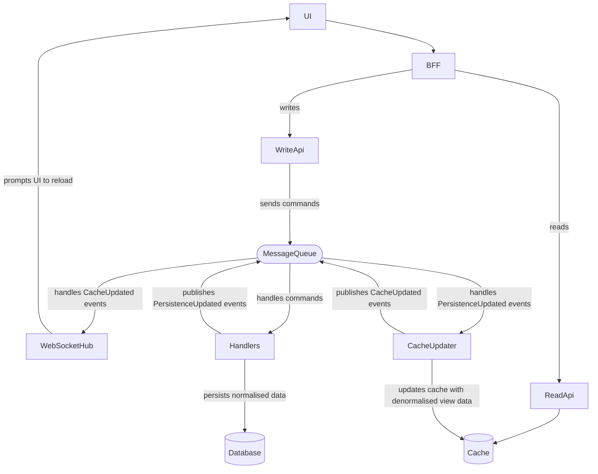

# CQRS Proof of Concept

A simple todo application using CQRS concepts:



## Run

To run the application in watch mode:

```shell
docker compose -f docker/docker-compose.yaml up --watch
```

Navigate to http://localhost:8000 to view the UI

Grafana for logs, traces & metrics @ http://localhost:3000

## Pipeline

### Creating the registry

```shell
scw registry namespace create name=cqrs-poc
```

### Set the SCW secret to push images from github workflows

```shell
gh secret set \
    SCW_SECRET_KEY \
    --repo "github.com/IrrelevantElephant/cqrs-poc" \
    --app actions \
    --body $SCW_SECRET_KEY
```

### Build and push
```shell
docker build -f Handlers/Dockerfile -t rg.fr-par.scw.cloud/cqrs-poc/handlers:latest .
docker push rg.fr-par.scw.cloud/cqrs-poc/handlers:latest
```